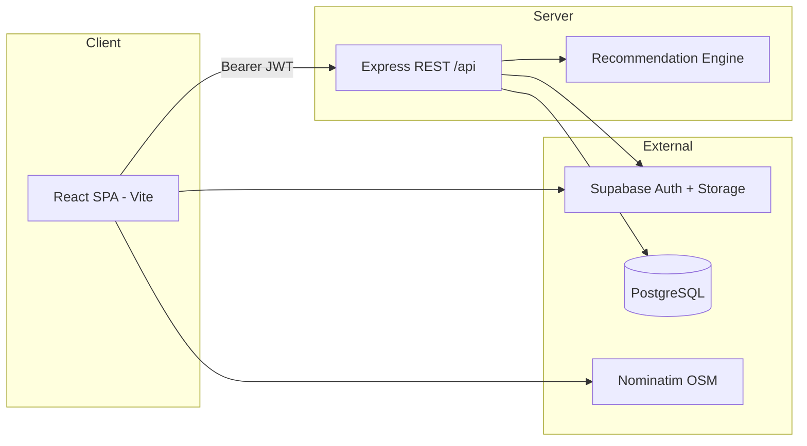

# Software Requirements Specification (SRS)

## RealNest — Intelligent Real Estate Platform

| Field | Value |
|-------|-------|
| **Document version** | 2.1 |
| **Product name** | RealNest |
| **Package name** | `realestate` |
| **Scope** | Behavior as implemented in this repository |
| **Basis** | Reverse-engineered from `backend/`, `frontend/`, and `backend/prisma/schema.prisma` |

---

## 1. Introduction

### 1.1 Purpose

This SRS defines the functional and non-functional requirements for **RealNest**, a full-stack real estate web application with **role-based access** (buyer vs. seller), **Supabase-backed authentication**, **PostgreSQL** persistence via **Prisma**, **image storage** on Supabase, a **hybrid recommendation engine** (content-based + collaborative filtering), **seller subscriptions and credits**, **legal document signing (OTP)**, **purchase intents**, **installment-based checkout**, and **offline property sale recording** (sales completed outside the platform).

The system supports:

- **Buyers**: browse, save, like, receive AI recommendations, express purchase intent, sign legal documents via OTP, and complete simulated checkout (full price or installments).
- **Sellers**: manage listings under plan limits, boost visibility with credits, subscribe to Pro/Agency tiers, generate sale deeds/rent agreements, **mark for-sale listings as sold offline**, and track sales and analytics (platform + offline).
- **Agency sellers** (Agency plan): manage company profiles, agent rosters, and bulk listing operations.

### 1.2 Intended audience

Developers, testers, academic reviewers, and stakeholders who need a single reference for features, data, APIs, and constraints.

### 1.3 Definitions and acronyms

| Term | Definition |
|------|------------|
| **Profile** | App user linked to Supabase `userId`; role `BUYER` or `SELLER` |
| **Property** | Listing with type, status, price, location, media, and archive state |
| **Interaction** | `VIEW`, `SAVE`, `LIKE`, `FAVORITE` (API supports all; UI uses VIEW, LIKE, SAVE) |
| **Transaction** | Platform payment record: `PENDING` → `PROCESSING` → `COMPLETED` or `FAILED` |
| **Offline transaction** | Seller-recorded sale when a property is sold outside RealNest; stores sale date, price, buyer contact (optional), payment type, and handover status |
| **Document** | Legal artifact: `SALE_DEED` or `RENT_AGREEMENT`; lifecycle `DRAFT` → `SELLER_SIGNED` → `FULLY_EXECUTED` |
| **Purchase intent** | Buyer's request to buy a `FOR_SALE` property; triggers the seller deed workflow |
| **Sale installment** | Scheduled payment (token / possession / balance) after an executed sale deed |
| **Credits** | Seller virtual currency used for boosts and verification |
| **Boost** | `HOT`, `PREMIUM`, or `PLATINUM` listing promotion (30 days, Pro/Agency only) |

### 1.4 References

- `README.md` — setup, environment variables, tech stack
- `backend/prisma/schema.prisma` — data model source of truth
- `backend/src/config/subscriptionPlans.js` — plan pricing and entitlements

---

## 2. Overall description

### 2.1 Product perspective



| Layer | Technology |
|-------|------------|
| **Frontend** | React, Vite, Tailwind, React Query, react-leaflet, react-hot-toast, jsPDF/html2pdf |
| **Backend** | Node.js, Express, Prisma ORM |
| **Database** | PostgreSQL (Supabase-hosted in documented setup) |
| **Auth** | Supabase Auth; JWT on `Authorization: Bearer` |
| **Storage** | Supabase bucket `property-images` (listing photos); PDFs for executed documents |
| **Maps** | Leaflet + OpenStreetMap; Nominatim geocoding (~1 req/sec, debounced on seller form) |

### 2.2 User classes and characteristics

| Class | Capabilities |
|-------|--------------|
| **Guest** | Home, browse/filter listings, property detail, map; no like/save/purchase without login |
| **Buyer** | Recommendations, saved/liked, purchase intents, document signing, checkout, receipts, installments |
| **Seller (Free)** | Up to 2 active listings, basic visibility, credit purchase, listing renew |
| **Seller (Pro)** | Unlimited listings, boosts, analytics, verified badge, priority ranking |
| **Seller (Agency)** | Pro features + agency profile, multi-agent roster, bulk status/delete |
| **Admin** (lightweight) | Platform revenue via secret header or allowlisted email |

### 2.3 Operating environment

| Variable | Purpose |
|----------|---------|
| `PORT` | Backend default `5000` |
| `HOST` | Default `0.0.0.0` |
| `DATABASE_URL` | Prisma connection |
| `SUPABASE_URL`, `SUPABASE_ANON_KEY`, `SUPABASE_SERVICE_ROLE_KEY` | Auth and storage |
| `VITE_API_URL`, `VITE_SUPABASE_*` | Frontend API and Supabase client |
| `ADMIN_SECRET`, `ADMIN_EMAILS` | Admin gate (optional in dev) |
| `NODE_ENV=production` | Stricter CORS |

### 2.4 Design and implementation constraints

- **Payments** are **simulated** (delay ~2.5s, then success). JazzCash, Easypaisa, and Card are labels/enums only.
- **Subscription upgrades** require a simulated `transactionId` from the mock checkout UI.
- **OTP** for document signing: dev mode uses fixed `123456`; production logs the OTP (SMS gateway is a placeholder).
- **Currency** is displayed as **PKR** on key screens.
- **Listing expiry**: new listings get `listingExpiresAt` = now + 6 months; renew via credits.
- **CORS (production)**: private LAN hostnames allowed; other origins rejected.

### 2.5 Assumptions and dependencies

- Supabase project configured; public bucket `property-images` exists.
- Prisma schema pushed (`npx prisma db push`); optional seed data available.
- Sellers on the Free plan cannot exceed 2 active (non-SOLD, non-PAUSED, non-archived) listings.
- The `featured` flag is data-driven (seed/DB), not exposed in the seller create form.

---

## 3. System features — functional requirements

### 3.1 Health and diagnostics

| ID | Requirement |
|----|-------------|
| FR-HLTH-1 | `GET /api/health` returns `{ status: 'ok', timestamp: ISO8601 }`. |

### 3.2 Authentication and profile

| ID | Requirement |
|----|-------------|
| FR-AUTH-1 | `POST /api/auth/register`: `email`, `password`, `name`, `role` (BUYER \| SELLER); optional `phone`. Creates Supabase user + Prisma `Profile`. Handles duplicate registration via sign-in merge. |
| FR-AUTH-2 | `POST /api/auth/login`: returns `user`, `session`, `profile`. |
| FR-AUTH-3 | `GET /api/auth/profile`: authenticated read. |
| FR-AUTH-4 | `PUT /api/auth/profile`: partial update of `name`, `phone`, `avatar`. |
| FR-AUTH-5 | Missing Supabase config → 503-style errors on auth routes. |
| FR-AUTH-6 | Frontend `AuthProvider`: session sync, Bearer token on Axios, `login` / `register` / `logout` / `fetchProfile`. |
| FR-AUTH-7 | `/auth/callback` page for Supabase redirect flows. |

**Profile fields (extended):** `credits`, `verifiedBadge`, `subscriptionPlan`, `subscriptionStatus`, `subscriptionStartDate` / `EndDate`, `listingLimit`, `isVerified`, agency fields (`companyName`, `companyLogo`, `companyDescription`, `officeAddress`).

### 3.3 Property catalog

| ID | Requirement |
|----|-------------|
| FR-PROP-1 | `GET /api/properties`: filters — `city`, `type`, `status`, `minPrice`/`maxPrice`, `minBedrooms`/`maxBedrooms`, `minArea`/`maxArea`, `search` (title/description/address), `sortBy` ∈ {createdAt, price, area, bedrooms}, `order`, `page`, `limit` (default 12). Excludes **archived** listings (`archiveStatus: ACTIVE`). Default excludes `PAUSED` and **`SOLD`** when no status filter. |
| FR-PROP-2 | `GET /api/properties/featured`: up to 6, `featured === true`, `createdAt` desc. |
| FR-PROP-3 | `GET /api/properties/:id`: detail with seller summary, interaction counts, and sale-lock metadata for authenticated viewers. |
| FR-PROP-4 | `POST /api/properties`: seller only; validated required fields; sets `listingExpiresAt` (+6 months). **Listing limit** enforced for Free plan. |
| FR-PROP-5 | `PUT /api/properties/:id`: seller owner only; **rejects edits when `status` is `SOLD`**. |
| FR-PROP-6 | `DELETE /api/properties/:id`: seller owner only. |
| FR-PROP-7 | `GET /api/properties/mine`: seller's **active** listings (`archiveStatus: ACTIVE`, `status` ≠ `SOLD`). |
| FR-PROP-9 | When a listing becomes `SOLD` (platform checkout or offline sale), `soldAt` is set; listing is removed from marketplace browse/recommendations and seller "My Listings". |
| FR-PROP-8 | `PATCH /api/properties/:id/archive`: seller archives/unarchives a listing (`PropertyArchiveStatus`: ACTIVE \| ARCHIVED). |

**Enums:**

- `PropertyType`: HOUSE, APARTMENT, VILLA, DUPLEX, WAREHOUSE, INDUSTRIAL, RESORT, OTHER
- `PropertyStatus`: FOR_SALE, FOR_RENT, SOLD, **PAUSED**
- Optional: `deedDocument`, `pausedFromStatus`, `soldAt`, coordinates, `images[]`

### 3.4 User interactions

| ID | Requirement |
|----|-------------|
| FR-INT-1 | `POST /api/interactions/track`: upsert by (user, property, type). |
| FR-INT-2 | `DELETE /api/interactions/track`: remove a specific type. |
| FR-INT-3 | `GET /api/interactions/mine`: optional `?type=` filter. |
| FR-INT-4 | `POST /api/interactions/save` / `DELETE .../save/:propertyId` / `GET .../saved`. |
| FR-INT-5 | UI: VIEW on detail when logged in; like/save with toasts; guests prompted to log in. |
| FR-INT-6 | `FAVORITE` supported in API/schema but **not used in the frontend**. |

### 3.5 Recommendation engine ("AI-powered")

| ID | Requirement |
|----|-------------|
| FR-REC-1 | `GET /api/recommendations`: authenticated; `?limit=` (default 12). |
| FR-REC-2 | **Content-based (60%)**: weights VIEW=1, SAVE=3, LIKE=4, FAVORITE=5; scores type, city, price/bed/bath/area proximity. |
| FR-REC-3 | **Collaborative (40%)**: similar users' positive signals on unseen properties. |
| FR-REC-4 | Excludes properties the user has **VIEW**ed and listings with status **`SOLD`** or **`PAUSED`**; scores up to 50 candidates. |
| FR-REC-5 | Cold start: popular newest listings, fixed score 50, reason "New listings". |
| FR-REC-6 | Each item includes a human-readable `reason`. |
| FR-REC-7 | Buyer dashboard "For You" tab with AI badge. |

### 3.6 Image upload

| ID | Requirement |
|----|-------------|
| FR-UPL-1 | `POST /api/upload/images`: multipart `images`, max **10** files. |
| FR-UPL-2 | Per file: max **5 MB**; JPEG, PNG, WebP, GIF. |
| FR-UPL-3 | Upload to `property-images`; returns public URLs; partial failure returns `urls` + `errors`. |

### 3.7 Purchase intents (sale workflow)

| ID | Requirement |
|----|-------------|
| FR-PI-1 | `POST /api/purchase-intents`: buyer expresses interest in a **`FOR_SALE`** property only (`SOLD` rejected); upsert unique (property, buyer). |
| FR-PI-2 | `GET /api/purchase-intents/for-property/:propertyId`: buyer's intent for a listing. |
| FR-PI-3 | `GET /api/purchase-intents/buyer` / `seller`: lists intents with property/document summary. |
| FR-PI-4 | Sale lock: a property is reserved for one committed buyer when a deed/installment exists; blocks other buyers. |
| FR-PI-5 | Seller dashboard panel shows intents; seller generates a sale deed for the selected buyer. |

### 3.8 Legal documents and OTP signing

| ID | Requirement |
|----|-------------|
| FR-DOC-1 | Types: `SALE_DEED`, `RENT_AGREEMENT`. Status: `DRAFT` → `SELLER_SIGNED` → `FULLY_EXECUTED` (or `CANCELLED`). |
| FR-DOC-2 | `POST /api/documents/generate`: seller; `propertyId`, `type`, `buyerId`; links purchase intent. |
| FR-DOC-3 | `GET /api/documents/buyers/search?q=`: seller searches buyers (min 2 chars). |
| FR-DOC-4 | `POST /api/documents/send-otp` / `verify-otp`: role `seller` \| `buyer`; records IP, timestamps, OTP flags. |
| FR-DOC-5 | Sale deed: buyer cannot sign until `buyerNotifiedAt` (seller releases via `POST .../notify-buyer-ready`). Rent agreement notifies buyer on create. |
| FR-DOC-6 | On buyer sign → `FULLY_EXECUTED`, PDF generated (pdfkit), uploaded to Supabase, `documentHash` stored. |
| FR-DOC-7 | `GET /api/documents/for-purchase/:propertyId`: buyer checkout prerequisite check. |
| FR-DOC-8 | `GET /api/documents/seller/:id`, `/buyer/:id`, `/:documentId`: list/detail with visibility rules. |
| FR-DOC-9 | Frontend: `DocumentsTab`, `/documents/:documentId` sign page, `OTPModal`. |

### 3.9 Transactions and checkout

| ID | Requirement |
|----|-------------|
| FR-TXN-1 | `POST /api/transactions/create`: buyer; requires a **fully executed** sale deed (FOR_SALE) or rent agreement (FOR_RENT). Blocks PAUSED, self-purchase, sold property, and installment properties. |
| FR-TXN-2 | Reuses an existing `PENDING` transaction for the same buyer+property. |
| FR-TXN-3 | `POST /api/transactions/process`: `paymentMethod` ∈ {JAZZCASH, EASYPAISA, CARD}; ~2.5s simulation; COMPLETED + property **`SOLD`** with `soldAt` (for-sale purchases only; rent flow unchanged). |
| FR-TXN-4 | `GET /api/transactions/:id`: buyer or property seller. |
| FR-TXN-5 | `GET /api/transactions/mine` (buyer), `/sales` (seller: **platform** `COMPLETED` + **offline** sales, merged by sale date). |
| FR-TXN-6 | Frontend: `/payment/:propertyId`, `/receipt/:id` (print/download PDF; offline sales have no platform receipt). |
| FR-TXN-7 | `POST /api/transactions/offline-sale`: **seller only**; records an off-platform sale (see §3.10). |

### 3.10 Offline property sale recording

| ID | Requirement |
|----|-------------|
| FR-OFF-1 | `POST /api/transactions/offline-sale`: authenticated seller; body — `propertyId`, `saleDate`, `salePrice`, `transactionType`, `handoverStatus`; optional `buyerName`, `buyerContact`, `notes`. |
| FR-OFF-2 | **Validation:** property must belong to seller; property must be **`FOR_SALE`** (not already **`SOLD`**); `salePrice` > 0; `saleDate` required and valid. |
| FR-OFF-3 | **Transaction types:** `CASH`, `BANK_TRANSFER`, `INSTALLMENTS`, `OTHER`. **Handover:** `COMPLETED`, `PENDING`. |
| FR-OFF-4 | On success: create **`OfflineTransaction`** (one per property, unique `propertyId`); set property `status` → **`SOLD`**, `soldAt` → `saleDate`; deactivate active **boosts** for that listing. |
| FR-OFF-5 | Sold listing excluded from public catalog, recommendations, purchase intents, and seller **My Listings**; appears in **Sold Properties** tab. |
| FR-OFF-6 | `GET /api/seller/sold-properties`: seller's **`SOLD`** listings with platform transaction and/or offline sale details. |
| FR-OFF-7 | Frontend: **Mark as Sold** button on `FOR_SALE` rows in seller dashboard; modal fields — sale date, final price (PKR), transaction type, handover status; optional buyer name/contact/notes; loading state, toast on success, list refresh. |
| FR-OFF-8 | **Analytics:** offline sales count toward `totalSales` and `salesRevenue` in `GET /api/analytics/seller`. |

**Example request** (`POST /api/transactions/offline-sale`):

```json
{
  "propertyId": "<cuid>",
  "saleDate": "2026-06-01",
  "salePrice": 15000000,
  "transactionType": "CASH",
  "handoverStatus": "COMPLETED",
  "buyerName": "Optional",
  "buyerContact": "+92...",
  "notes": "Optional"
}
```

### 3.11 Sale installments and payment plans

| ID | Requirement |
|----|-------------|
| FR-INST-1 | After an executed **sale deed**, the system creates installments (token / on possession / balance) per the selected plan. |
| FR-INST-2 | `GET /api/sale-installments/property/:propertyId`: buyer's schedule. |
| FR-INST-3 | `POST /api/sale-installments/:installmentId/start-payment`: begins an installment payment (simulated). |
| FR-INST-4 | Frontend `/checkout/:propertyId/plan`: buyer selects society-style sale plans or rent lease plans (PKR breakdown). |
| FR-INST-5 | Full single-price transaction is blocked when installments exist for the buyer+property. |

**Sale plan examples:** Society Standard (20/30/50%), Smart City Balanced, Accelerated Token.
**Rent plans:** Standard lease, Reduced deposit (security/advance months, lease term).

### 3.12 Seller subscriptions

| ID | Requirement |
|----|-------------|
| FR-SUB-1 | Plans (PKR/month): **FREE** (0, 2 listings), **PRO** (2999, unlimited, boosts, analytics, verified), **AGENCY** (7999, + multi-agent, company profile, bulk). Duration: 30 days. |
| FR-SUB-2 | `GET /api/subscription/plans` (public). |
| FR-SUB-3 | `GET /api/subscription/me`, `/transactions`; `POST /upgrade/pro`, `/upgrade/agency`, `/cancel`. |
| FR-SUB-4 | Upgrade requires a simulated payment `transactionId` + `paidAmount`; sellers only. |
| FR-SUB-5 | `checkSubscriptionExpiry` middleware refreshes expired plans. |
| FR-SUB-6 | Frontend: `/subscription`, `SubscriptionPlans`, `CheckoutPlan`, mock Stripe modal. |

### 3.13 Seller credits, boosts, and listing lifecycle

| ID | Requirement |
|----|-------------|
| FR-CR-1 | `POST /api/seller/credits/purchase`: simulated credit purchase (`creditsAmount`, `transactionId`). |
| FR-CR-2 | `GET /api/seller/credits/balance`. |
| FR-CR-3 | `POST /api/seller/listings/boost`: HOT=1, PREMIUM=2, PLATINUM=3 credits; 30 days; **Pro/Agency only**. |
| FR-CR-4 | `POST /api/seller/listings/renew`: extend an expired listing (credit cost). |
| FR-CR-5 | `POST /api/seller/profile/verify`: 10 credits → verified badge. |
| FR-CR-6 | `PATCH /api/seller/boosts/expire`: expire boosts and listings past `listingExpiresAt`. |
| FR-CR-7 | `GET /api/seller/notifications`, `/archived-properties`, **`/sold-properties`**. |

### 3.14 Seller analytics (premium)

| ID | Requirement |
|----|-------------|
| FR-AN-1 | `GET /api/analytics/seller`: Pro/Agency only; views, saves, inquiries, **total sales** (platform + offline), **sales revenue** (completed transactions + offline `salePrice`). |
| FR-AN-2 | Frontend `SellerAnalyticsPanel` on the seller dashboard. |

### 3.15 Agency management

| ID | Requirement |
|----|-------------|
| FR-AG-1 | Requires an active **AGENCY** subscription. |
| FR-AG-2 | `GET/PUT /api/agency/profile`: company branding fields. |
| FR-AG-3 | `GET/POST/PUT/DELETE /api/agency/agents`: roster (not separate auth users). |
| FR-AG-4 | `PATCH /api/agency/listings/bulk-status`, `DELETE /api/agency/listings/bulk`. |
| FR-AG-5 | Frontend `/dashboard/agency` (`AgencyDashboard`). |

### 3.16 Admin

| ID | Requirement |
|----|-------------|
| FR-ADM-1 | `GET /api/admin/platform-revenue`: gated by `x-admin-secret` === `ADMIN_SECRET` OR email in `ADMIN_EMAILS`; open in non-production if neither is configured. |
| FR-ADM-2 | Aggregates subscription and credit revenue for demo analytics. |

### 3.17 Maps and geocoding

| ID | Requirement |
|----|-------------|
| FR-MAP-1 | `MapComponent`: listings with lat/lng on Leaflet (home, browse toggle, detail). |
| FR-MAP-2 | `LocationPickerMap` + Nominatim debounce (~700ms) on seller create/edit. |

### 3.18 User interface — routes and pages

| Route | Access | Purpose |
|-------|--------|---------|
| `/` | Public | Marketing home, hero search, featured, map, FAQ |
| `/properties` | Public | Filters, pagination, map, like/save |
| `/properties/:id` | Public | Gallery, detail, buy/intent, map |
| `/login`, `/register` | Public | Auth |
| `/auth/callback` | Public | OAuth callback |
| `/dashboard/buyer` | BUYER | Tabs: For You, Saved, Liked, Transactions, Documents |
| `/dashboard/seller` | SELLER | Listings CRUD, **Mark as Sold (offline)**, credits, boosts, analytics, documents, purchase intents, **Sold Properties** tab |
| `/dashboard/agency` | SELLER + Agency plan | Agency profile, agents, bulk ops |
| `/subscription` | Public/seller | Plan comparison |
| `/checkout/:propertyId/plan` | BUYER | Payment plan selection |
| `/payment/:propertyId` | BUYER | Simulated payment |
| `/receipt/:id` | Auth (party) | Receipt PDF |
| `/documents/:documentId` | Auth (party) | Review and sign |

**ProtectedRoute:** unauthenticated → `/login`; wrong role → `/`; 5s loading timeout.

---

## 4. Data requirements

### 4.1 Entity relationships (summary)

| Entity | Key relationships |
|--------|-------------------|
| **Profile** | 1:N properties, interactions, transactions, offlineTransactions, creditTransactions, boosts, agency agents |
| **Property** | belongs to seller; has interactions, documents, purchase intents, installments, offline sale (0–1) |
| **UserInteraction** | unique (userId, propertyId, interactionType) |
| **SavedProperty** | unique (userId, propertyId) |
| **Transaction** | buyer platform payment; optional 1:1 SaleInstallment |
| **OfflineTransaction** | seller-recorded off-platform sale; unique `propertyId`; `saleDate`, `salePrice`, `transactionType`, `handoverStatus`; optional buyer fields and `notes` |
| **Document** | seller + buyer + property; optional purchase intent link |
| **PropertyPurchaseIntent** | unique (propertyId, buyerId) |
| **SaleInstallment** | tied to document + property + buyer |
| **PropertyBoost** | HOT/PREMIUM/PLATINUM, expiry |
| **SubscriptionTransaction** | plan purchase history |
| **CreditTransaction** | PURCHASE / SPENT ledger |
| **AgencyAgent** | unique (agencyId, email) |

### 4.2 Integrity rules

- Cascade deletes from profile/property where defined in the schema.
- Indexes on property: city, status, archiveStatus, type, price.
- The public catalog only shows `archiveStatus: ACTIVE` and excludes `SOLD` by default.
- At most one `OfflineTransaction` per property (`propertyId` unique).
- `SOLD` properties cannot be edited via `PUT /api/properties/:id`.

---

## 5. External interface requirements

### 5.1 REST API summary

| Prefix | Auth | Main operations |
|--------|------|-----------------|
| `/api/health` | No | Health |
| `/api/auth/*` | Mixed | Register, login, profile |
| `/api/properties/*` | Mixed | CRUD, featured, mine, archive |
| `/api/interactions/*` | Yes | Track, save, lists |
| `/api/recommendations` | Yes | Personalized feed |
| `/api/upload/images` | Yes | Multipart images |
| `/api/transactions/*` | Yes | Create, process, **offline-sale**, history |
| `/api/purchase-intents/*` | Yes | Intent CRUD |
| `/api/documents/*` | Yes | Generate, OTP, sign, lists |
| `/api/sale-installments/*` | Yes | List, pay installment |
| `/api/subscription/*` | Mixed | Plans, upgrade, cancel |
| `/api/seller/*` | Seller | Credits, boost, renew, archive, **sold-properties** |
| `/api/analytics/seller` | Seller + Pro | Metrics |
| `/api/agency/*` | Seller + Agency | Profile, agents, bulk |
| `/api/admin/platform-revenue` | Admin | Revenue |

### 5.2 User interfaces

- Responsive Tailwind UI; React Query stale time ~1 min; loading skeletons; PKR formatting.
- Home page stats/testimonials are **static marketing copy**, not DB-derived.

---

## 6. Non-functional requirements

| ID | Area | Requirement |
|----|------|-------------|
| NFR-PERF-1 | Performance | Recommendations score ≤50 candidates; acceptable for small/medium catalogs |
| NFR-SEC-1 | Security | JWT validation on protected routes; role checks (buyer/seller/admin) |
| NFR-SEC-2 | Security | Seller can only mutate own properties; transaction visibility limited to parties |
| NFR-SEC-3 | Security | Document OTP + IP logging for audit trail |
| NFR-AVAIL-1 | Availability | Global Express error handler → JSON 500 |
| NFR-UX-1 | Usability | Toasts for mutations; tabbed dashboards with URL `?tab=` on buyer side |
| NFR-I18N-1 | Localization | English UI; PKR currency |
| NFR-MAINT-1 | Maintainability | Single source for subscription plans (`subscriptionPlans.js`) |

---

## 7. Out of scope / known limitations

| Item | Detail |
|------|--------|
| Real PSP | JazzCash/Easypaisa/Card are simulated only |
| SMS OTP | Logged in dev; no production SMS provider wired |
| `FAVORITE` | API only; no UI |
| Admin UI | Revenue endpoint only; no full admin portal |
| Featured toggle | Not in seller form; seed/DB only |
| Agency agents | Display roster only — not separate login accounts |
| Email verification | Not emphasized in UI |
| Multi-currency / i18n | PKR display only |

---

## 8. Typical end-to-end flows

### 8.1 Buyer purchases a for-sale property (with deed + installments)

1. Browse → open detail → express **purchase intent**.
2. Seller generates **sale deed**, signs (seller OTP), notifies buyer.
3. Buyer signs (buyer OTP) → document **FULLY_EXECUTED** → installments created.
4. Buyer selects plan at `/checkout/:id/plan` → pays installments via `/payment`.
5. On completion, property → **SOLD**; receipt available.

### 8.2 Buyer rents a property

1. Seller generates **rent agreement** (buyer notified on create).
2. Both parties sign via OTP → executed agreement.
3. Full rent checkout via transaction (per rent plan amounts on the checkout page).

### 8.3 Seller upgrades to Pro

1. Visit `/subscription` → mock payment → `POST /api/subscription/upgrade/pro`.
2. Listing limit removed; boosts and analytics unlocked.

### 8.4 Seller records an offline sale

1. Seller opens **My Listings** on `/dashboard/seller` and selects **Mark as Sold** on a `FOR_SALE` property.
2. Modal: enter sale date, final price (PKR), transaction type (Cash / Bank Transfer / Installments / Other), handover status (Completed / Pending); optionally buyer name, contact, notes.
3. `POST /api/transactions/offline-sale` → property **`SOLD`**, listing removed from marketplace and active listings.
4. Sale appears under **Sold Properties**, **Recent Sales**, and seller **analytics** (Pro/Agency).

---

## 9. Traceability

| SRS section | Primary implementation |
|-------------|------------------------|
| Auth | `backend/src/routes/auth.js`, `frontend/src/context/AuthContext.jsx` |
| Properties | `propertyController.js`, `propertyArchiveController.js` |
| Recommendations | `backend/src/services/recommendations.js` |
| Documents | `backend/src/routes/documents.js`, `utils/generateDocument.js` |
| Transactions | `transactionController.js`, `offlineTransactionController.js`, `propertySaleLockService.js` |
| Offline sales | `offlineTransactionController.js`, `soldPropertiesController.js`, `MarkAsSoldModal.jsx`, `useOfflineSale.js` |
| Subscriptions | `subscriptionController.js`, `subscriptionService.js` |
| Credits/Boosts | `sellerCreditsController.js` |
| Agency | `agencyController.js`, `AgencyDashboard.jsx` |
| Schema | `backend/prisma/schema.prisma` |

---

## 10. Notes

Requirements in this document are **reverse-engineered from the implementation** (routes, controllers, Prisma schema, and primary React pages). For formal IEEE-830-style sections (approval signatures, change control, detailed request/response schemas, use-case diagrams, and test cases), extend this document as needed.
